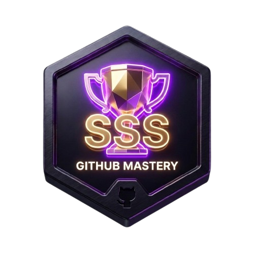

<div align="center">
  
</div>

[](https://opensource.org/licenses/MIT)
[](https://nodejs.org)
[](https://github.com/Jbansal2/git-trophy-generator/actions)
[](CONTRIBUTING.md)

Decorate your GitHub profile with awesome trophies!

## API Usage

### Basic Usage:

```
http://localhost:3000/trophy?username=YOUR_GITHUB_USERNAME
```

### Examples:

**Basic:**

```markdown

```

**With Theme:**

```markdown

```

**Filter by Rank:**

```markdown

```

**Exclude Trophies:**

```markdown

```

**Transparent Background:**

```markdown

```

## How to Add to Your GitHub Profile?

1. Open your GitHub profile README.md file
2. Copy the markdown code from the trophy generator
3. Paste it into your README.md
4. Commit and push!

## Trophies

### Rank System:

The rank system evaluates your GitHub profile across 7 different categories. Each trophy has its own ranking thresholds based on the metric.

#### Rank Badges:

| Rank    | Badge                               | Title          | Tier         | Achievement                |
| ------- | ----------------------------------- | -------------- | ------------ | -------------------------- |
| **SSS** |  | Legendary      | Mythic       | Top 0.1% - Living legend   |
| **SS**  |   | Grandmaster    | Elite        | Top 1% - Elite status      |
| **AAA** |  | Champion Elite | Master       | Top 3% - Masters level     |
| **AA**  |   | Champion       | Expert       | Top 5% - Expert level      |
| **S**   |    | Star Performer | Advanced     | Top 10% - Well established |
| **A**   |    | Veteran        | Intermediate | Top 20% - Experienced      |
| **B**   |    | Challenger     | Intermediate | Top 45% - Rising star      |
| **C**   |    | Contender      | Beginner     | Top 72% - Active member    |
| **D**   |    | Rookie         | Rookie       | Just getting started       |

<!--

| **Stars**         | ⭐   | 100K | 50K | 30K | 20K  | 10K | 2K  | 400 | 80  | 1   |
| **Commits**       | 💻   | 20K  | 10K | 7K  | 6K   | 5K  | 2K  | 1K  | 500 | 100 |
| **Issues**        | 🔧   | 1K   | 500 | 350 | 250  | 200 | 100 | 50  | 20  | 5   |
| **Pull Requests** | 🔀   | 500  | 300 | 225 | 180  | 150 | 75  | 30  | 10  | 2   |
| **Followers**     | 👥   | 10K  | 5K  | 3K  | 2K   | 1K  | 200 | 50  | 10  | 1   |
| **Repositories**  | 📦   | 200  | 100 | 75  | 60   | 50  | 20  | 10  | 5   | 1   |
| **Experience**    | �️    | 12y  | 10y | 9y  | 8.5y | 8y  | 5y  | 3y  | 2y  | 1y  |

#### How Ranks Work:

- Each trophy category is ranked independently based on your GitHub activity
- Your overall trophy card displays all 7 categories with their current ranks and progress
- The progress bar shows how close you are to the next rank tier
- Ranks are calculated in real-time based on your public GitHub profile data

#### Special Rank Titles by Category:

**Stars Titles:** Rookie → Emerging → Rising Star → Popular → Acclaimed → Mega Star → Ultra Star → Superstar → Legendary Project

**Commits Titles:** Rookie → Active → Investigator → Reporter → Fixer → Debugger → Dedicated → Consistent → Relentless Coder

**Issues Titles:** Rookie → Reporter → Investigator → Debugger → Fixer → Issue Solver → Bug Hunter → Guardian → Bug Slayer

**Pull Requests Titles:** Rookie → Helper → Contributor → Collaborator → Merger → PR Champion → Merge Expert → Merge Master → Integration Legend

**Followers Titles:** Rookie → Known → Rising Voice → Influencer → Community Leader → Rising Star → Influencer Elite → Icon → Celebrity

**Repositories Titles:** Rookie → Starter → Builder → Creator → Architect → Project Master → Repository King → Founder → Empire Builder

**Experience Titles:** Rookie → Learner → Apprentice → Journeyman → Veteran → Elder → Ancient One → Master → Legend

_Note: Thresholds and titles are customized for each trophy category to reflect meaningful achievement levels_

-->

## Themes

- **Flat**: Clean and simple design
- **Dark**: For dark mode lovers
- **OneDark**: Popular code editor theme
- **Radical**: Bold and colorful
- **Gruvbox**: Retro developer theme
- **Dracula**: Dark vampire theme

## Node.js Support 🚀

This project uses **Node.js** runtime with modern ES modules!

### Why Node.js?

✅ Mature ecosystem with npm packages\
✅ Wide community support\
✅ Production-ready with excellent performance\
✅ Built-in testing with node:test\
✅ Native ES modules support

## Docker Deployment 🐳

### Using Docker:

**Build image:**

```bash
docker build -t github-trophy .
```

**Run container:**

```bash
docker run -p 3000:3000 --env-file .env github-trophy
```

**Or with inline token:**

```bash
docker run -p 3000:3000 -e GITHUB_TOKEN=your_token_here github-trophy
```

### Using Docker Compose:

**Start services:**

```bash
docker-compose up -d
```

This will start the GitHub Trophy app on port 3000.

**View logs:**

```bash
docker-compose logs -f
```

**Stop services:**

```bash
docker-compose down
```

**Rebuild:**

```bash
docker-compose up -d --build
```

### Environment Variables:

Create `.env` file with your GitHub token:

```
GITHUB_TOKEN=ghp_your_token_here
```

Or add multiple tokens (comma-separated):

```
GITHUB_TOKEN=token1,token2,token3
```

## Deployment Options:

You can deploy this to:

- 🐳 **Docker** (local or VPS)
- Vercel
- Heroku
- Railway
- Render
- AWS ECS/EKS
- Google Cloud Run
- Azure Container Instances

After deployment, replace the URL with your production URL.

## Testing

Run all tests:

```bash
npm test
```

Run tests in watch mode:

```bash
npm test -- --watch
```

Format code:

```bash
npm run format
```

Lint code:

```bash
npm run lint
```

## Contributing

Contributions are welcome! Please read our
[Contributing Guidelines](CONTRIBUTING.md) and
[Code of Conduct](CODE_OF_CONDUCT.md) before submitting PRs.

### Development Setup

1. Fork and clone the repository
2. Create a `.env` file from `.env.example`
3. Add your GitHub token (optional but recommended)
4. Run the development server:
   ```bash
   npm run dev
   ```
5. Make your changes and add tests
6. Run tests: `npm test`
7. Format code: `npm run format`
8. Submit a PR!

## Security

For security issues, please review our [Security Policy](SECURITY.md).

## License

MIT License - see the [LICENSE](LICENSE) file for details.

## Acknowledgments

- Built with [Node.js](https://nodejs.org) 🚀
- Powered by [GitHub GraphQL API](https://docs.github.com/en/graphql)
- Inspired by the amazing GitHub developer community

---

Made with ❤️ for GitHub developers

**Star ⭐ this repo if you found it useful!**
